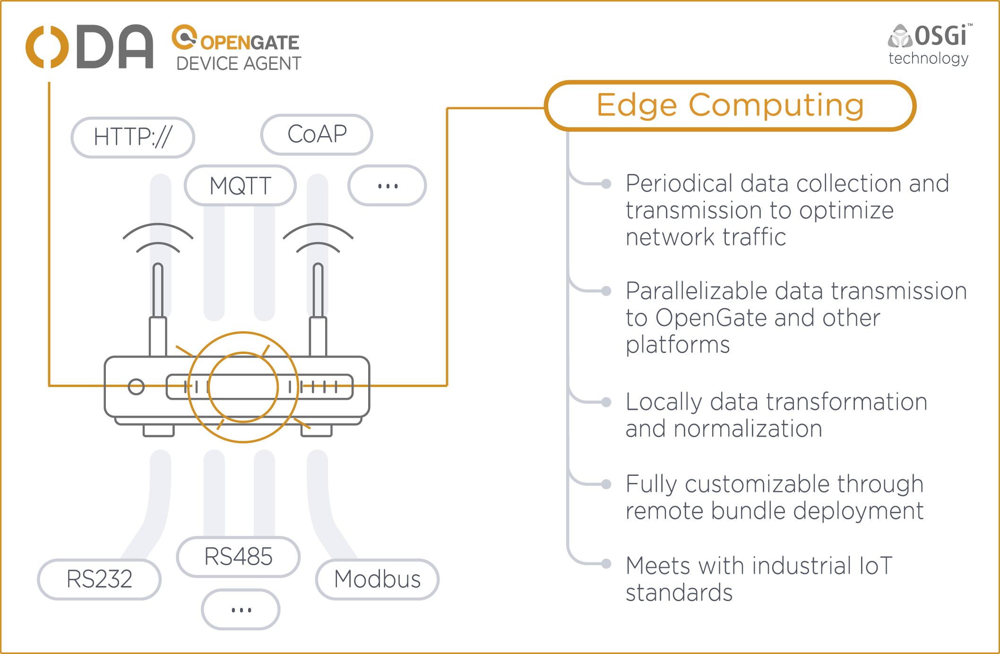

# ODA

OpenGate Device Agent was created to provide an easy way to integrate your devices and business data in our IoT Platform OpenGate. From this goal, ODA has grow integrating new protocols and platforms. ODA supports HTTP, WebSocket, MQTT, CoAP communication protocols and integrates with third party services as SCADA through DNP3 and IEC-104. ODA also acts as a concentrator of constrained devices in your local network using MQTT, Modbus, RS232, RS485, GPIOs... We are currently working on Edge Computing features offering more intelligence to work with your data in real-time and reducing data consumption.  



## Getting started

### Prerequisites

This software must be installed to build and run the application:

- [Java 8](https://www.java.com/en/download/faq/java8.xml)
- [Maven](https://maven.apache.org/)
- [Git client](https://git-scm.com/) (sudo apt install git)
- [Mercurial client](https://www.mercurial-scm.org/) (sudo apt install mercurial)
- [CMake](https://cmake.org/) (sudo apt install cmake)

### Building

To build the project you should use Maven. Before compiling the software you should install in your Maven local repository some ODA external dependencies not available in the Maven Central Repository

```shell
git clone --recursive git@github.com:amplia-iiot/oda.git
cd oda
cd oda-externaldependencies
mvn clean install
cd ..
mvn clean package
```

The build includes two ODA assemblies to make some test with our software using MQTT and CoAP protocols. The assemblies can be found inside *oda-demos* folder.

### Running

To run ODA you have to untar the assembly and run the script provided inside the *bin* folder. This script will launch ODA in background.

```shell
tar xjf mqtt-${project.version}.tar.bz
cd mqtt
bin/run.sh start
```

To connect to the ODA Remote Console you should open an SSH connection to *localhost* to the port *50000*. The default SSH credentials are username *oda* and password *oda*

ODA will collect device management data of the device and send it 30 seconds from start-up and every 5 minutes. This data is sent through MQTT and CoAP and can be seen using the tools explained in the testing section.

There is a log file inside log folder to see information about the ODA execution.

### Testing the application

To test our application and have a feeling about its features you can run a MQTT broker or CoAP server locally and check the recollected data and send some operations

#### Local MQTT broker

To test ODA through MQTT you can use [Eclipse Mosquitto](https://mosquitto.org/) to install an MQTT broker in your local computer and communicate with our application.

To prepare the environment in an Ubuntu system and get Mosquitto Broker running:

```shell
# Install mosquitto
sudo apt-add-repository ppa:mosquitto-dev/mosquitto-ppa
sudo apt update
sudo apt install mosquitto
# Start mosquitto broker
sudo service mosquitto start
```

Once you follow these steps you will have a MQTT Broker running on your computer.

To subscribe to the IoT messages sent by ODA you should run the command:

```shell
mosquitto_sub -t odm/iot/testDevice
```

To send operations to ODA you should run the command:

```shell
mosquitto_pub -t odm/iot/testDevice -m '<json_operation>'
```

An example of an operation is:

```json
{
   "operation":{
      "request":{
         "name":"REFRESH_INFO",
         "parameters":[],
         "id":"5e6c7200-44c7-4eab-8831-966adf8cc930"
      }
   }
}
```

In the [resources](resources) folder you may find other operation examples.

#### Local CoAP server

An easy way to get a CoAP server running locally is using [Node-RED](https://nodered.org/) with the CoAP support provided by [node-red-contrib-coap](https://flows.nodered.org/node/node-red-contrib-coap)

To prepare the environment in an Ubuntu system and get Node-RED installed and running with CoAP support:

```shell
# Install Node.js prerequisite
sudo apt install nodejs
# Install Node-RED
sudo npm install -g --unsafe-perm node-red
# Install node-red-contrib-coap
sudo npm -g node-red-contrib-coap
# Run Node-RED
node-red
```

Once you follow these steps you can access your Node-RED instance from your preferred browser in the URL [http://127.0.0.1:1880/](http://127.0.0.1:1880/)

Now, you can import our flow [Process IoT CoAP requests](resources/process-coap-iot-requests-flow.json) to see and process the CoAP IoT requests sent by ODA and made your own flows.

### Configuring ODA

ODA configuration files are stored inside configuration folder. This files should be modified with care because are critical for ODA proper working

Some useful modifications could be:

- Change device id from *es.amplia.oda.datastreams.deviceinfo.cfg* file with deviceId property.
- Change MQTT broker host from *es.amplia.oda.connector.mqtt.cfg* file with host property.
- Change SSH server configuration and credentials from *es.amplia.oda.subsystem.sshserver.cfg* file.
- Change polling configuration from *es.amplia.oda.subsystem.poller.cfg* file.
- Change dispatching configuration from *es.amplia.oda.dispatcher.opengate.cfg* file.

### ODA documentation

You can explore in depth how ODA works in its [documentation](https://amplia-iiot.github.io/oda-docs/).

### Next steps

If you like what you are seeing [contact our sales team](https://www.amplia-iiot.com/contact-information-sales/) with your proposal and feel the full potential of our IoT Platform [OpenGate](https://www.amplia-iiot.com/opengate-iot-platform/) to see your data online and so much more. The sales team will analyze your business needs and give you access to an Api-Key to connect ODA to OpenGate and see your data in our platform.

## Main Features

ODA main features are:

- Collect IoT data from device
- Send IoT data to OpenGate
- Attend OpenGate operations

ODA currently support the next devices:

- X86-64 architecture computers (as development and test environment)
- [Raspberry Pi](https://www.raspberrypi.org/)
- Sierra Wireless [FX30/FX30S](https://source.sierrawireless.com/devices/fx-series/fx30/) devices
- Owasys [OWA450](https://www.owasys.com/en/products/owa450) device

Other devices with same architecture may be supported but has not been tested.

## Software Design Overview

ODA is developed in Java to adapt to a wide range of devices. We based our architecture on top of [OSGi](https://www.osgi.org/) to provide a module based software highly configurable, well-suited for any IoT project.

Some of these modules are:

- **Connectors**: Modules providing a variety of protocols to connect to OpenGate or other servers.  
- **Dispatchers**: Modules abstracting data sent and received from ODA to adapt it to different transport formats.
- **Operations and Events**: Operations to interact with recollected data and controlled devices and events to inform of business logic events like alarms.
- **Datastreams**: Modules responsible for model data recollected from the device.
- **Services and subsystems**: Different services and subsystems responsible for concrete features as polling, SSH server or data serialization.
- **Hardware access**: Modules abstracting hardware access easing the access to data and mapping them to datastreams.

Combining generic modules highly tested and specific project and device modules, ODA will be capable to answer your business needs remarkably with a short time-to-market.

## Contributing

ODA is developed by Amplía Soluciones company as open-source. We will be pleased to have feedback and suggestions of features you may find interesting

Feel free to contact us writing to [oda@amplia.es](mailto:oda@amplia.es?subject=[GitHub]) or opening your pull request.

## License

The code in this project is licensed under Apache License 2.0 [LICENSE](LICENSE)
